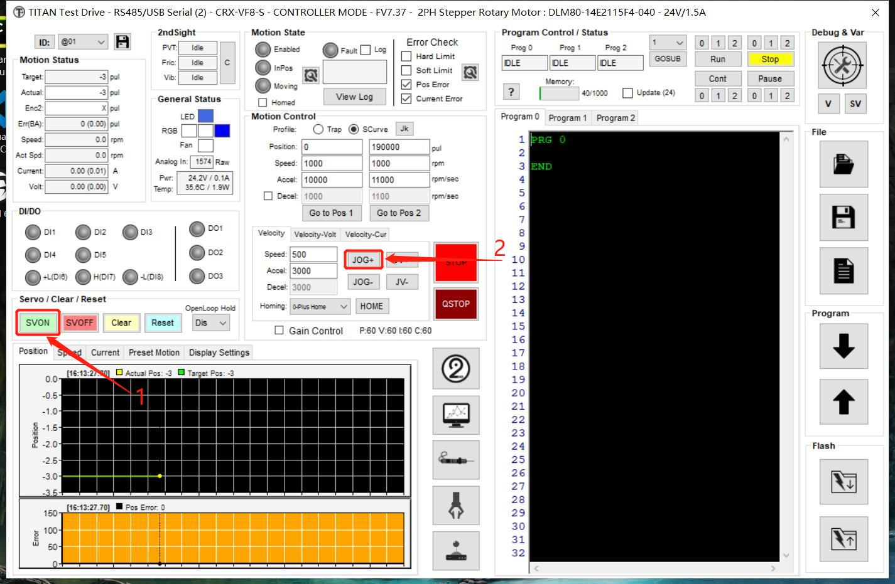
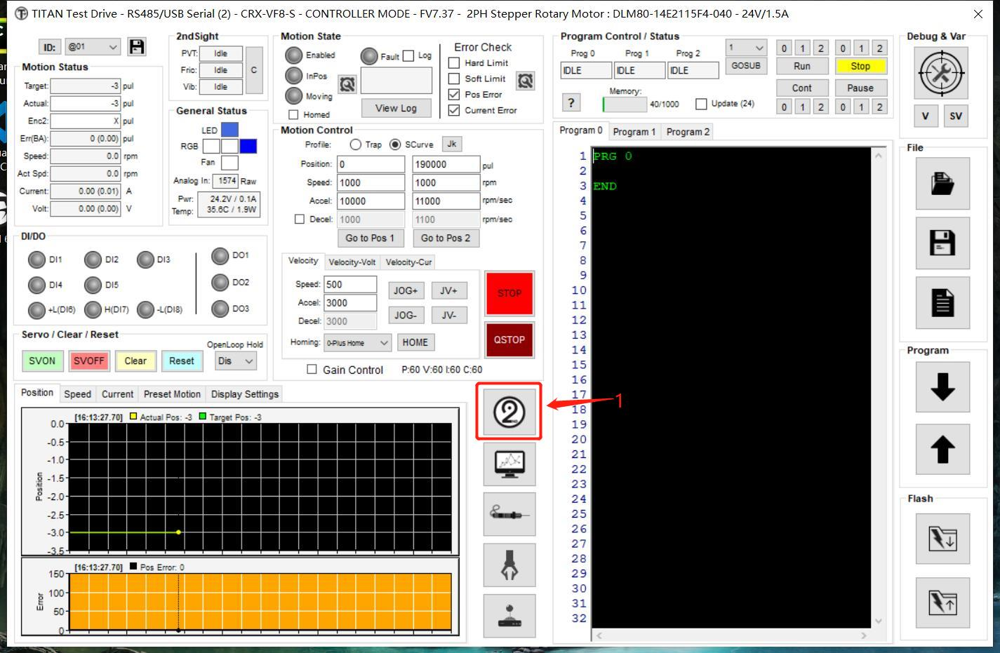
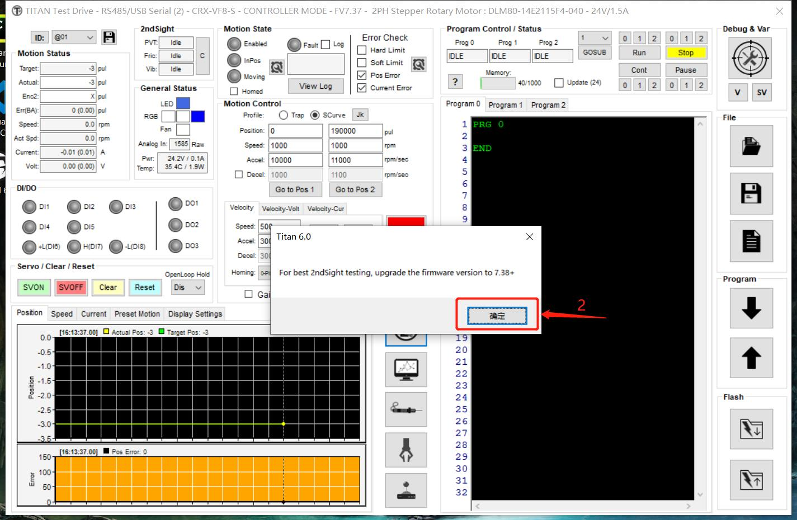
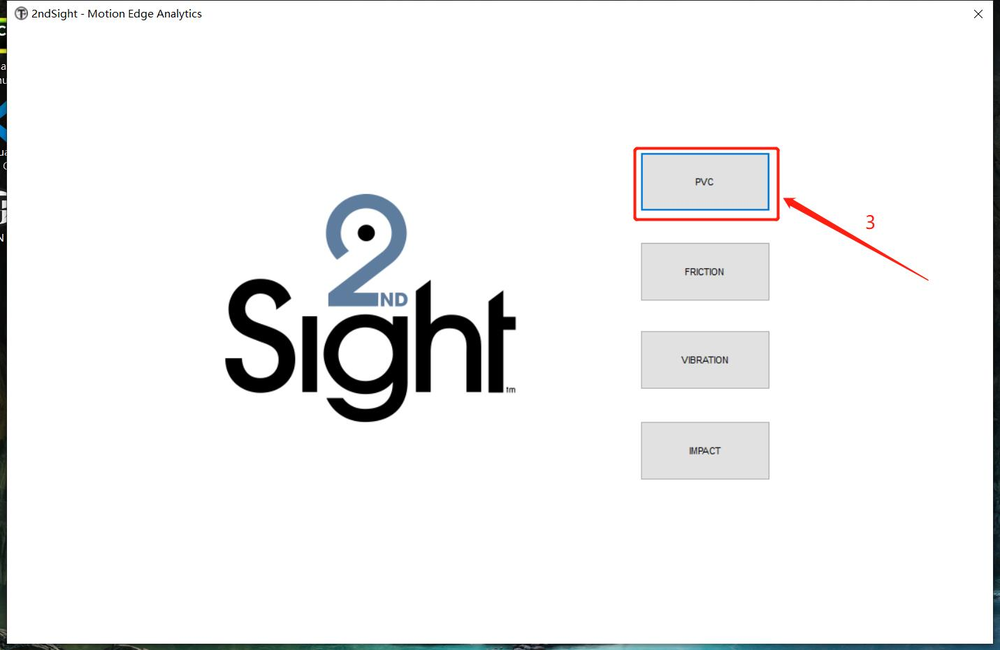
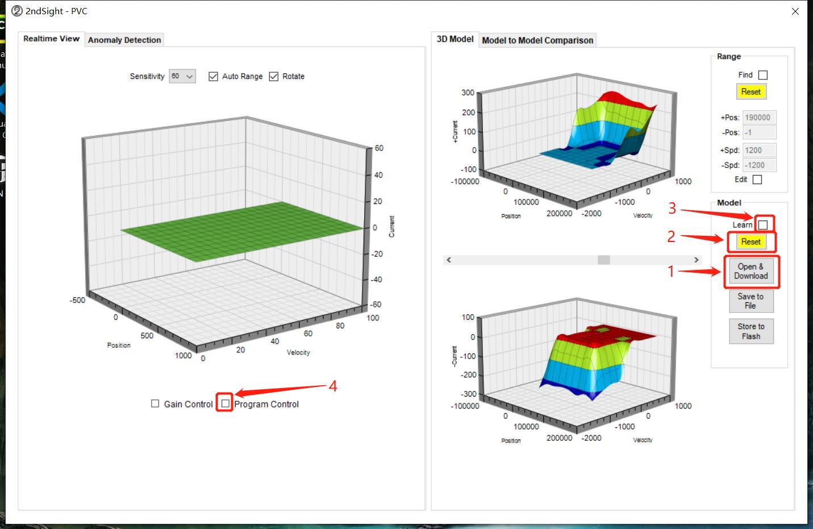
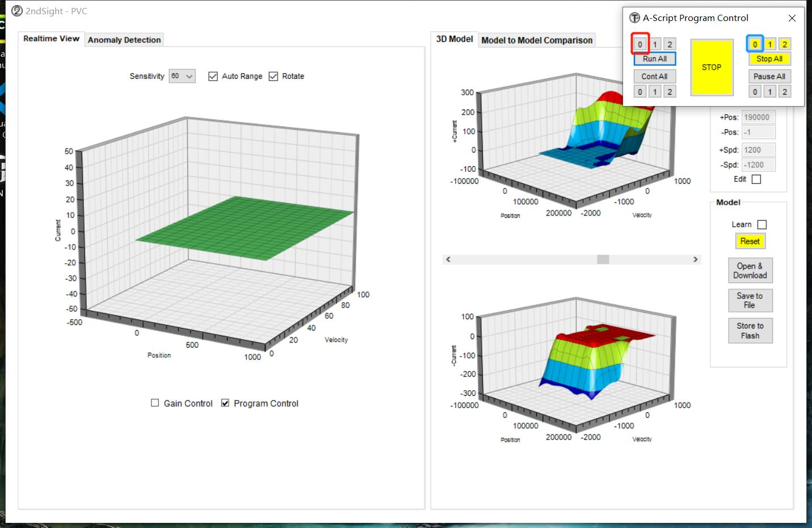
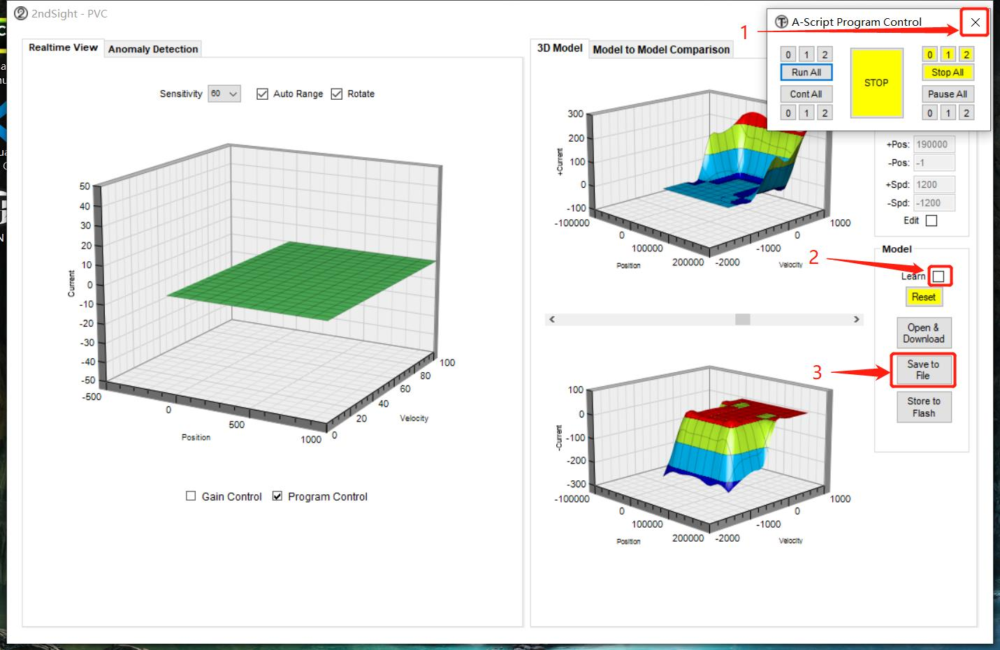
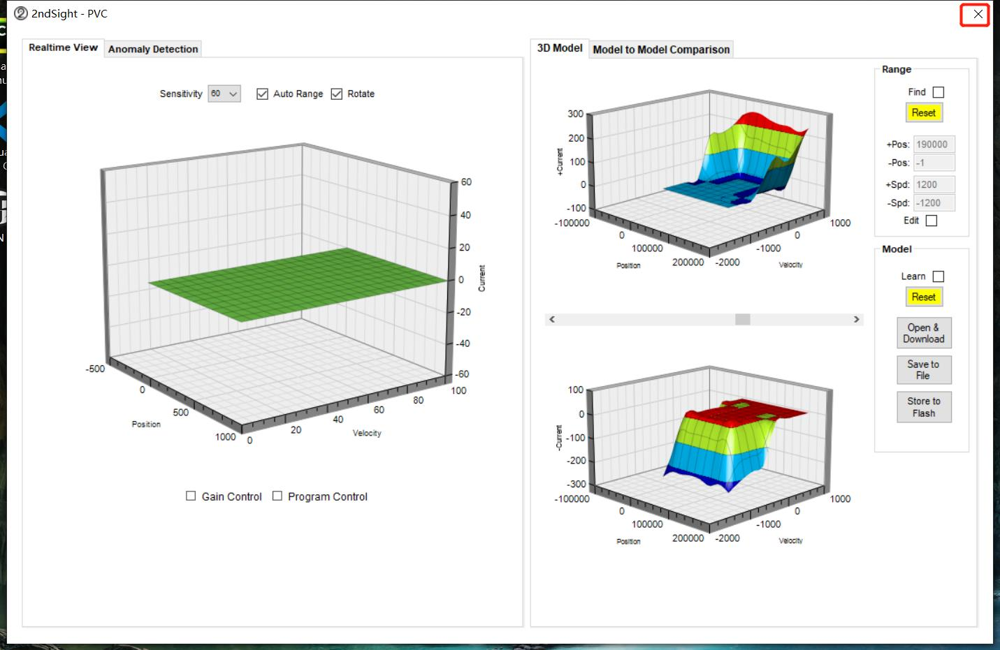
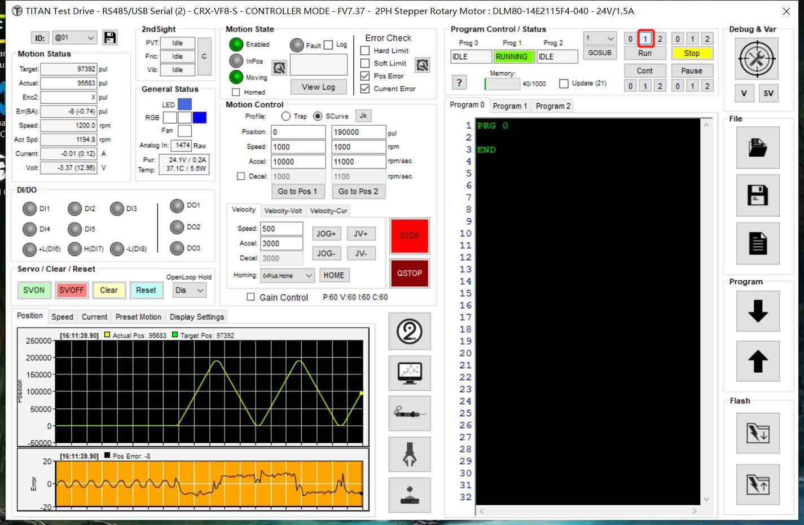
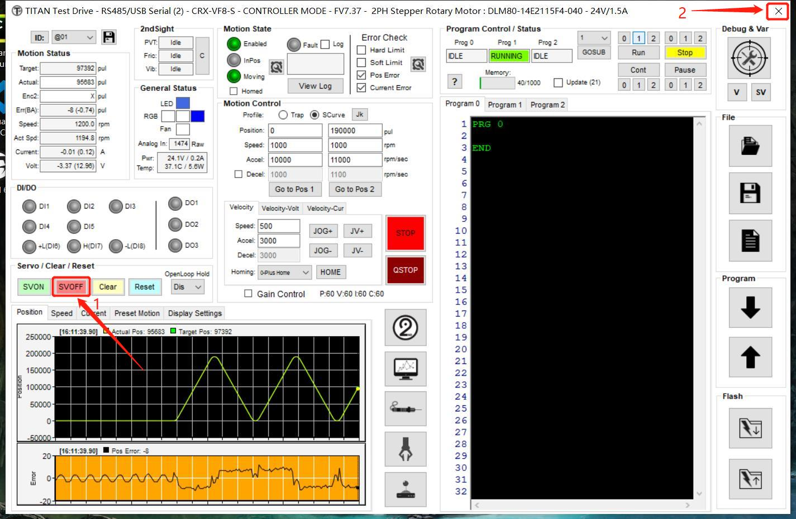

# 数据采集手册

1. 手动调整电机靠近解码器一端。尽量到头

2. 打开软件

    

3. 测试电机

    - Jog++
  
        

        首先点击`1`标签，其次再 **！！！长按！！！** `2` 按键。如果出现任何弹窗请按 `确定` 或者 `是`。 直到电机动为止。如果没有弹窗，并且电机没有移动。请叫技术人员来检查

4. 采集PVC数据

    - 打开PVC

        

        

        

    - 运行程序，并采集数据 (P.S. 打开`桌面` -> `数据` -> `<对应型号>` -> `01 PVC数据` -> `<.pvc文件>`)

        

        (P.S.)下图只需要点击红色方框，如果发现在10秒过后，电机仍然没有移动，则点击`蓝色方框` -> `红色方框`。如果还是没有启动，则重复以上行为。重复3次以上电机仍然没有动静。请叫技术人员检查。

        

        直到电机停止移动，则启动以下步骤

        

        弹出保存选项之后，保存到`桌面 -> 数据 -> <对应电机型号>`文件夹下。文件名为 `M[1...](.pvc)`。

    - 退出PVC模式

        

        

5. 采集电流数据

    - 运行程序

        
    
    - 采集数据

        等待电机停止运转之后，点击红框

        

        之后的所有弹窗都是按 `确定` 或者 `是`

        

6. 完成一台机器